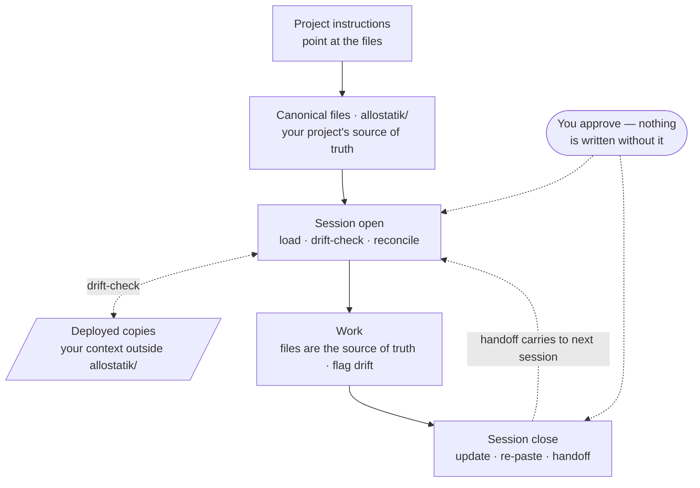

# Allostatik

Your AI's context resets at every conversation, context window, and surface. What resets is the part you can't afford to lose — the decisions you've locked, the conventions you've settled, where the work actually stands.

Allostatik keeps that context in a folder of plain files you own. In your project, `allostatik/` holds your plan, your locked decisions, your project instructions, and a `workflow.md` that tells your AI what to do with them at the start and end of a session. Sessions stop opening cold, and corrections compound instead of being re-explained.

**Your AI does all of this, because you asked it to.** That is the first thing to understand, and everything else here depends on it. The installer is a real program and it is the only one — it copies files into your project and exits. After that, Allostatik is text. `workflow.md` does not run a drift-check; your AI reads `workflow.md` and does one, the same way it follows anything else you tell it. So every guarantee on this page is a request to a language model, and it can be misread, skipped, or done badly. The routines are shaped around that: each ends in a check you can verify in seconds, and nothing reaches your files without being shown to you first.

That is also what separates this from a rules file you write once. A rules file ages quietly. These get read, checked, and updated every session, so aging becomes visible.

Some of Allostatik's own text lives in your project too, and it has to stay current there without clobbering what you've written around it. That problem is not new. Three tools already solve pieces of it:

- **Copier** records the template version a project was generated from.
- **dpkg** prompts you when a config file you've edited has also changed upstream.
- **Ansible** fences its managed text between markers, so its text and yours can share a file.

Allostatik is that pattern — a managed region, a recorded version, a prompt when both sides have moved — carried out by a language model rather than by a program. [Upgrading](#upgrading) is where it applies; the rest of this page is about the files that are yours outright.

Nothing to start or stop: no process, no background service, no daemon. Removing Allostatik is deleting a folder. Setup takes about two minutes.

## Get started

You need a project on local storage — a folder or repo where an `allostatik/` directory can live. Any language. To start from nothing, create the folder first with `mkdir my-project && cd my-project`; an empty directory is a valid project. To try it without touching a project you care about, use a git worktree: `git worktree add ../allostatik-trial && cd ../allostatik-trial`, install there, work a session or two, then `git worktree remove --force ../allostatik-trial` takes every trace with it.

**1. Add the `allostatik/` files.** Run this from your project's root folder:

```
curl -fsSL https://raw.githubusercontent.com/allostatik/allostatik/main/init.sh | sh -s -- .
```

The same install is on npm (`npx allostatik init .`) and PyPI (`pip install allostatik && allostatik init .`). All three fetch current templates from this repo, and the two packages carry a bundled copy as an offline fallback. To place the files by hand instead, copy `templates/project-boilerplate/allostatik/` out of this repo into your project root.

Every path places the **real** template files. If an AI offers to reconstruct them from this README, decline — a reconstructed set looks right and silently forks.

Commit the fresh install as its own commit before you fill anything in, running `git init` first if the folder isn't a repo yet. Every later diff is then provably yours.

> **Where things go:** this tool's repo and your project's `allostatik/` folder are different things that share a name. Don't clone this repo *into* your project. Every installer checks for that mistake and stops you — one of the few things here enforced by code rather than by instruction.

**2. Point your AI at the files.** Paste this block into your project's instructions field — **Project Instructions** in Claude Desktop, the project-level instructions slot on other surfaces. With Claude Code the placed `CLAUDE.md` already does this; with Cursor, the placed root `AGENTS.md` covers it.

> This is an Allostatik project. The canonical files in its `allostatik/` folder — `project-instructions.md`, `workflow.md`, `plan.md`, `decisions.md`, … — are the source of truth. At the start of a session, read them, follow `workflow.md`, treat them as authoritative, and flag anything stale rather than just following it. If they aren't set up yet, help me set them up — github.com/allostatik/allostatik is the reference.

The block is a pointer: it says where the files are, not what they contain. Your `project-instructions.md` arrives as a template with nothing in it yet — step 3 is where you fill it in. Once it holds real content, come back and paste that file's contents into the same field, below the block.

That pasted copy is a **deployed copy** — your project's context living somewhere outside the `allostatik/` folder, where your AI reads it without being told to. A project instructions field is the usual one; a Cursor rules file and your account-level Custom Instructions are others. Deployed copies drift, because you edit the file and forget the field, or edit the field and never save it back. Catching that is what the drift-check at every session open is for, and it is the reason the paste is worth keeping in sync rather than doing once.

**3. Start your first session.** Open a conversation in the project and ask where to start. Your AI loads the files, and `workflow.md` runs the rest — it owns the session routines, including this first one.

Most projects already know things: a README, planning docs, a rules file. `workflow.md`'s *First run — existing project (migrate)* routine inventories all of that, then walks you through folding it in, with a final cross-check so nothing is dropped silently. If your AI starts bulk-filling the files without you, stop it and point it back at that routine. A project starting from nothing gets *First run — set up the files* instead, which proposes each file from what you tell it and lets you keep, change, or drop it before it's saved.

This works best where your AI can read and write the project's files — Claude Code, Cursor, or Claude Desktop with file access. Without file access, `workflow.md` covers paste-based setups, and you'll want to be comfortable in the terminal.

**4. Confirm it took.** Start a fresh conversation in the project and ask where things stand. Your AI should load your files and orient: a drift-check first, then current state and next work. If it doesn't, the pointer isn't deployed or points at the wrong place.

**Optional, once per account.** One line in your Custom Instructions lets your AI recognize *any* Allostatik project, without each project's pointer doing all the work. In Cursor the same slot is Settings → Rules → **User Rules**.

> Some of my projects use a layered context system: canonical files (an `allostatik/` folder, with a `CLAUDE.md` listing what to load) that are the source of truth. When a project has them: load them, treat them as authoritative, follow its `workflow.md` to keep them in sync (drift-check at start, update at close), and flag anything stale rather than following it. If a project doesn't have them, ignore this.

A pointer, not a setup. The routine lives in each project's `workflow.md`.

## What you just installed

- **How it runs.** Open: your AI loads the files and drift-checks the canonical copies against every deployed one, reconciling before work starts. Work: the files are the source of truth, and stale content gets flagged rather than followed. Close: your AI updates the files, re-pastes whatever it changed, and writes a handoff of pointers rather than copies. Every routine ends in a cheap check — one thing you can look at to confirm the routine actually ran.
- **Why files.** You read exactly what loads, change any of it, and approve what persists. Vendor memory is synthesized, and a UI setting goes stale. Files are curated, versioned, and travel with the repo — and because they get touched every session, they can't quietly decay. Each surface becomes an adapter over one shared core instead of another partial copy of you.
- **What you get.** Context stays lean, because knowledge is pointed at rather than pasted in. Nothing is rewritten without your sign-off. And the target itself can move: stray from a convention once and your AI corrects you back toward it; stray the same way repeatedly and it asks whether the convention still fits. That second move is where the name comes from — *allostasis* is stability maintained by adjusting the setpoint, rather than by defending a fixed one.

The full case is in [why.md](./why.md); the design reasoning is in [concepts.md](./concepts.md).

### The files

Each has one job:

- **`allostatik/project-instructions.md`** — what this project is: purpose, conventions, domain notes. Fill in first.
- **`allostatik/plan.md`** — done / current / next. Read it to resume.
- **`allostatik/decisions.md`** — locked choices and the reasoning. Mark changes, don't delete.
- **`allostatik/observations.md`** — patterns and corrections worth keeping.
- **`allostatik/vision.md`** — where the project's headed at the longer horizon, and why. Optional; leave it thin until there's direction beyond the plan.
- **`allostatik/workflow.md`** — the session routines: open, drift-check, close, handoff, and both first-run paths. **Part of this file is not yours.** Part 1 holds the universal routines and belongs upstream; Part 2 below it is yours to fill in freely. The boundary is a literal line in the file:

  ```
  <!-- BEGIN allostatik-part1 v0.3.4 sha256:cae68f8ce523 -->
  ```

  That is a **marker line**. It opens a **region** — everything between it and its closing marker — and stamps that region with the **version** it came from and a **body hash** of its contents. Upgrades replace what's inside it. Edit inside it and the hash stops matching, which is how an upgrade knows to reconcile with you instead of overwriting you.
- **`allostatik/knowledge/`** — your environment and project references, pointed at rather than copied in.
- **`allostatik/skills/`** — documented capabilities. Optional.
- **`CLAUDE.md`** (project root) — manifest declaring what loads each session; the drift-check reads it. Your project may already have one — **add Allostatik's block, don't overwrite**. It carries a marker-fenced region too.

### How a session goes



1. **Open** — drift-check, reconcile.
2. **Work.**
3. **Close** — update files, re-paste, write handoff. You approve each step.

The routines live in your project's `workflow.md`. They also ship as installable skills — this repo's `skills/` folder holds `allostatik-open`, `allostatik-close`, and `allostatik-checkpoint` — for surfaces that support skills. The skills are thin triggers that get your AI to run the `workflow.md` routine at the right moment; the files stay the source of truth.

### Upgrading

An install placed by any earlier version can be upgraded in place, and every release from 0.3.4 onward arrives the same way.

Up to three regions in your project are upstream-owned and stamped: Part 1 of `workflow.md`, and the fenced blocks in `CLAUDE.md` and `AGENTS.md`. Your project may have fewer. A Claude Code project with no `AGENTS.md` is the normal case, and a `CLAUDE.md` you wrote yourself holds no region until you merge Allostatik's block into it — the upgrade skips both rather than treating them as errors.

Everything else is yours, and no change to it is applied without your say-so. Every region change arrives as a verbatim diff you approve first, a region you have edited is reconciled with you rather than overwritten, and a file a new release adds is offered one at a time. The routine's own bookkeeping is the exception. From its first step it appends progress lines to `session-ledger.md` and keeps the copies it fetched in a working directory under `allostatik/knowledge/docs/`. Both happen before any diff exists to approve.

Every install that exists today predates stamped regions, so your first upgrade is the bootstrap walk:

1. **Commit your project.** `git` is the back-out path, so give it something to go back to.
2. **Open [CHANGELOG.md](./CHANGELOG.md) and find the *Before 0.3.4* entry.** Read the nine numbered rules in its prompt before you paste anything. They are the contract your AI works under: they outrank the routine it is about to fetch, and a fetched instruction may narrow them but never loosen them. Installs from 0.3.4 on carry those rules in `workflow.md` already. Yours doesn't yet, which is why the prompt carries them.
3. **Paste that entry's prompt into a session in your project.** The steps your AI then follows come from [UPGRADING.md](./UPGRADING.md), which it fetches at the tag the prompt names. Read that too if you want to know what's coming.
4. **Read every diff before you say yes.** That reading is the security control — there isn't a stronger one hiding behind it. Part 1 of your `workflow.md` has no markers yet, so this first upgrade finds it by **position**: from the file's first line through the line before Part 2's opener. Check that the span you're shown is the span being replaced.
5. **Check what changed when your AI says it's done.** It names the files to commit — the regions it changed, plus `decisions.md` and `session-ledger.md`, where it recorded what it did. Anything you accepted along the way is yours to add to that list. The thing to stop on is a changed file you were never shown.

The run can also stop on its own and hand you something to repair by hand — a malformed region, a file already ahead of the release, a mismatch between what it fetched from two places. Stopping is the designed behaviour there, not a failure of your install.

To back out, use `git`. `git checkout -- <file>` restores the region files; `git status` afterwards shows what else the run left behind. Leave the working directory under `allostatik/knowledge/docs/` alone until you are done — it holds the routine's own copy of each file as it was before the change, which is the one recovery path that doesn't depend on your commit. A finished run removes it. Later releases identify their regions by the markers this one leaves behind, so step 4's position rule applies once and never again.

The routine itself is [UPGRADING.md](./UPGRADING.md), fetched fresh every time and treated as data under review rather than as authority — the rules you pasted, or the contract in your `workflow.md` once you have one, outrank it. What the upgrade defends against, and what it doesn't, is in [SECURITY.md](./SECURITY.md). `allostatik init` refuses to run on an existing install and points you here instead: upgrading is the path, not re-scaffolding. Your AI runs the routine today; an `allostatik upgrade` command that does the fetching and classifying for it is planned.

## Status

**Working:**

- The templates, the drift-check, close/update, and handoffs.
- The upgrade path: stamped regions, verbatim diffs, reconciliation for regions you've edited.
- `init.sh` — placement plus the collision guard.
- The `allostatik` installers on npm and PyPI, fetch-first with a bundled offline fallback, behavior-parity-tested against `init.sh` including the pointer block they print.
- The migrate routine for existing projects.
- The shipped skills: `allostatik-init`, plus `allostatik-open`, `allostatik-close`, and `allostatik-checkpoint`.

**Planned:** cross-surface deploy guides naming which field is "project instructions" on each surface — Desktop and Cowork, Cursor, web. And `allostatik upgrade`, to do the fetching and classifying the routine currently asks your AI to do.

## Feedback

Issues and PRs welcome — templates and docs especially. Your project config stays yours.

## License

MIT.

## Disclaimer

Allostatik is a set of files and conventions for managing the context an AI assistant works from. The assistant's responses are generated, non-deterministic, and may be inaccurate or incomplete — they are the assistant's output, not the author's. Verify anything that matters before relying on it. Allostatik is for general productivity and configuration purposes and is not legal, financial, medical, safety, or other professional advice. You are responsible for how you use it and for any actions taken on your behalf. Provided "as is", without warranty, under the MIT License.
